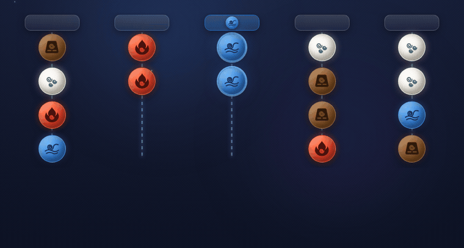

# Elemental

Play it now — [elemental-sort.vercel.app](https://elemental-sort.vercel.app)

A sorting puzzle: four elements — **Earth**, **Fire**, **Water** and **Air** —
hang tangled on ropes below floating platforms. Untangle them so every rope
holds one element, and restore the balance.



## How to play

- Grabbing an element takes it **and every element below it** — the whole group
  must be the same kind.
- A group drops only onto a rope whose bottom element matches (or onto an empty
  rope).
- A platform holds at most 4 elements and is **complete** with 4 of one kind.
- **Restricted platforms** are tinted and marked with an element's symbol: they
  only complete with their own element, and that element can _only_ be completed
  there.
- **Mystery elements** (purple `?`) are face-down until they reach the bottom of
  their rope.
- **Stone seals** cover a whole rope; they shatter when their badged element is
  completed elsewhere.
- **Vaults** (`a`/`b`/`c` colours) lock a whole rope until the matching-colour
  **key** — hung on an element on another rope — is freed to a rope's bottom. A
  key can be hidden _inside_ another vault, so vaults chain.

Campaign progress is stored server-side against an anonymous cookie. A level
unlocks only once the previous one is completed with a solution the server
replays and verifies — editing client state doesn't skip anything.

## Run it locally

Needs [Bun](https://bun.sh) and [Docker](https://www.docker.com).

```sh
docker compose up -d        # Postgres on localhost:5433
cp .env.example .env        # DATABASE_URL for the local db
bun install
bun run db:migrate          # apply migrations from drizzle/
bun run db:seed             # load levels from db/seeds/levels/
bun run dev                 # http://localhost:5173
```

Other commands:

```sh
bun run test                # vitest — level seeds + engine/solver checks
bun run check               # svelte-check / type checking
bun run build               # production build
bun run db:studio           # browse the db with Drizzle Studio
bun run db:generate         # new migration after editing the schema
```

## Ship to production

The app deploys to Vercel on push; the database lives on a hosted Postgres
(Neon). Put its connection string in `.env.production` (gitignored):

```sh
vercel env pull .env.production --environment=production
```

Then:

```sh
git push origin main        # Vercel builds & deploys the app

bun run db:migrate:prod     # only when the schema changed
bun run db:seed:prod        # only when db/seeds/levels/ changed
```

Both `:prod` commands run the same scripts as their local counterparts but with
`--env-file=.env.production`.

## Project layout

| Path                            | What                                                                                  |
| ------------------------------- | ------------------------------------------------------------------------------------- |
| `src/lib/game/engine.svelte.ts` | Game rules the player interacts with                                                  |
| `src/lib/game/solver.ts`        | Pure mirror of the rules — generation, level checks, **server-side win verification** |
| `src/lib/server/progress.ts`    | Per-player unlock + best-steps storage                                                |
| `src/routes/play/[level]/`      | The board, plus `complete/+server.ts` (replay & record a win)                         |
| `src/hooks.server.ts`           | Mints the anonymous player cookie                                                     |
| `db/seeds/levels/*.json`        | 50 hand-verified levels across 5 stages                                               |
| `drizzle/`                      | Schema migrations                                                                     |

### Levels

Generate a random, guaranteed-solvable seed:

```sh
bun scripts/generate-level.ts <number> <name> [seed] [restrictedCount] [stage] \
  [mysteryCount] [stoneSecretCount] [platformCount] [stoneMysteryEach] \
  [keyLockCount] [keysInVaults]

# e.g. a 6-platform level with 3 chained vaults:
bun scripts/generate-level.ts 51 "New Depths" 1 0 6 0 0 6 0 3 2
```

Verify every seed (solvable, element counts, restricted platforms, mysteries,
stones and keys/vaults all well-formed):

```sh
bun scripts/verify-levels.ts
```

The same checks — plus an engine-vs-solver consistency sweep — run under
`bun run test`.
